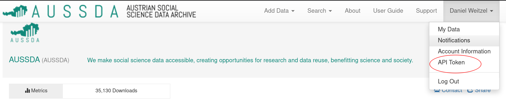
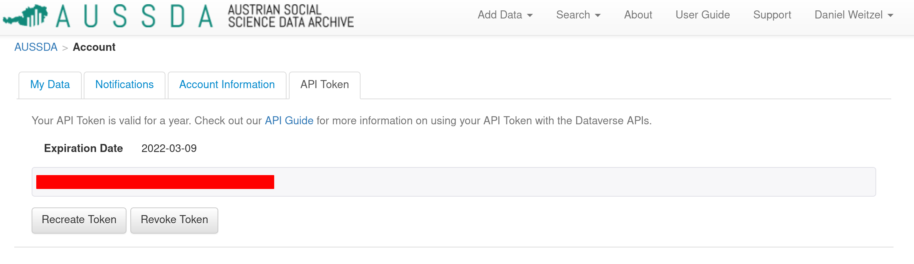

# Accessing AUSSDA data through the Dataverse API in R

In my current position at the University of Vienna I frequently work with data sets from the [Austrian Corona Panel Project](https://viecer.univie.ac.at/en/projects-and-cooperations/austrian-corona-panel-project/) (ACPP) and the [Austrian National Election Study](https://autnes.at/) (AUTNES). Both projects store their data in the Dataverse of the [Austrian Social Science Data Archive](https://data.aussda.at/) (AUSSDA). 

I'm a big fan of reproducible research and publicly available data sets are key for this. The mushrooming of dataverse repositories is an exciting development because it makes data sets available for everyone and brings us one step closer to fully reproducible research. However, I do not like to have data sets stored locally on my hard drive. The key concerns here are reproducibility across different computers and users as well as sacrificing disk space to data sets that might be outdated after an update, although the latter is not really an issue with the data sets from the ACPP and AUTNES. Lucklily, there is an easy solution: We can access the ACPP and AUTNES data sets through the [Dataverse API](https://guides.dataverse.org/en/latest/api/index.html). This also also speeds up the workflow of any project involving these data sets and allows to share code without sharing data sets that require each user to have individual access rights. 

## Setting things up

We'll be using the `dataverse` package available on CRAN (more information [here](https://iqss.github.io/dataverse-client-r/)). 
You can install it with the following line of code:

```
# Install from CRAN
install.packages("dataverse", dependencies = TRUE)
```

In order to be able to connect with the Dataverse API you will need an account with the [AUSSDA dataverse](https://data.aussda.at/). You can sign up through the SSO of your institution or using your email. After you have generated your account you'll need the `DATAVERSE_KEY`, which is the API Token that connects your API request with your registered dataverse account. You can obtain the API Token by logging into your account, clicking on your name in the top left, and selecting API Token as can be seen in the picture below.



After clicking on API Token you will be taken to a page (image below) where you can generate a 37 digit Token that is valid for one year. Under no circumstances should you share this token with anyone. Treat it like your username/password combination and make sure it is never included in code you share with others or push into a publicly available repository.



We can now set up the `R` script for the dataverse call. You should start with loading the library and specifying the `DATAVERSE_KEY`, which takes the API Token you copied from the AUSSDA website between the quotation marks. 

```
## Loading the dataverse library
library("dataverse")

## Specifying the API Token we received from AUSSDA
Sys.setenv("DATAVERSE_KEY" = "YOUR_API_KEY")
```

Calling data sets from the AUSSDA dataverse is done using the `get_dataframe_by_name()` function, which takes the following arguments:
- `filename` = The file name of the data set we want to download
- `dataset`  = The DOI of the repository that holds the data set we want to download
- `.f` = The function we want to use to read the data set. Since we have .tab data in both cases we use `read_dta()` from the `haven` package
- `server` = The server address. For the AUSSDA data this always is: *data.aussda.at*


## Austrian Corona Panel Project

The ACPP data exists in two versions. The SUF version for scientific use and an OA version for open access. If we want to download the ACPP data we can do so by gathering the relevant information from the repository pages of the [scientific use](https://data.aussda.at/dataset.xhtml?persistentId=doi:10.11587/28KQNS) or [open access](https://data.aussda.at/dataset.xhtml?persistentId=doi:10.11587/P5YJ0O) versions of the data. The filename and DOI for those are:

| Data Set  | filename             | DOI             | Server         |
| --------- |:--------------------:| :--------------:| :-------------:|
| ACPP SUF  | 10094_da_de_v2_0.tab | 10.11587/28KQNS | data.aussda.at |
| ACPP OA   | 10095_da_de_v1_0.tab | 10.11587/P5YJ0O | data.aussda.at |

If we want to download the scientific use version of the ACPP data we can do so by using the filename *10094_da_de_v2_0.tab* and the DOI *10.11587/28KQNS*. Hence, we can request the SUF data with the following `R` code:
```
# Coronapanel 
df_acpp_suf <-
  get_dataframe_by_name(
    filename    = "10094_da_de_v2_0.tab",
    dataset     = "10.11587/28KQNS",
    .f          = haven::read_dta,
    server      = "data.aussda.at")
```


## Austrian National Election Study 2017

The AUTNES panel surveys for the most recent Austrian election in 2017 were collected in two different ways. There exists an online panel study with six waves (4 pre- and 2 post-election) as well as a multi-mode study with phone and online modes (2 pre- and 1 post-election waves each). The modes, sample sizes, and survey times are very well explained [here](https://autnes.at/en/autnes-data/general-election-2017/).

From the repository page of the [AUTNES Online Panel Study 2017 (SUF edition)](https://data.aussda.at/dataset.xhtml?persistentId=doi:10.11587/I7QIYJ) and the [AUTNES Multi-Mode Panel Study 2017 (SUF edition)](https://data.aussda.at/dataset.xhtml?persistentId=doi:10.11587/NXDDPE) we can collect the filenames and DOI of the data sets:

| Data Set          | Year | filename             | DOI             | Server         |
| ----------------- | :--: |:--------------------:| :--------------:| :-------------:|
| AUTNES Online     | 2017 | 10096_da_en_v1_0.tab | 10.11587/I7QIYJ | data.aussda.at |
| AUTNES Multi-mode | 2017 | 10025_da_en_v1_0.dta | 10.11587/NXDDPE | data.aussda.at |

`R` code for requesting the AUTNES Online 2017 SUF version of the data set would look like this: 

```
# Autnes
df_autnes_online <- 
  get_dataframe_by_name(
    filename    = "10096_da_en_v1_0.tab",
    dataset     = "10.11587/I7QIYJ",
    .f          = haven::read_dta,
    server      = "data.aussda.at")
  ```

